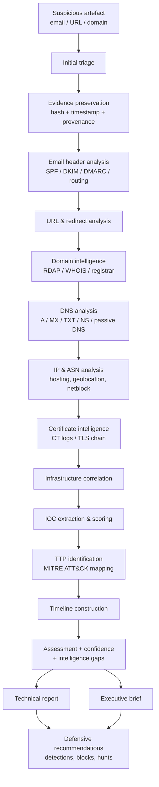

<<<<<<< HEAD
# Phishing Investigation & OSINT Casebook

**OSINT-Driven Phishing Investigation, Infrastructure Analysis & Threat Intelligence Reporting**

[](#disclaimer)
[](#synthetic-data-conventions)
[](LICENSE)

---

## What this is

A casebook of five structured phishing investigations, written the way a CTI or SOC analyst
would actually write them: an artefact arrives, it gets triaged, evidence is preserved,
OSINT is collected and validated, infrastructure is correlated, indicators are extracted,
techniques are mapped, uncertainty is stated explicitly, and the whole thing ends in a
report a defender can act on.

The point of the repository is **analytical reasoning**, not tool inventory. Anyone can run
a WHOIS lookup. The harder and more interesting question — the one this casebook tries to
answer on every page — is *what does this observation actually license me to conclude, and
what would have to be true for me to be wrong?*

## Why it exists

Junior CTI and SOC candidates are usually assessed on two things that a certificate cannot
demonstrate:

1. Can you separate an observation from an inference?
2. Can you be useful to a defender while still being honest about what you don't know?

Screenshots of tool output do not show either. A written investigation trail does. Each case
here therefore shows the reasoning, the rejected hypotheses, and the intelligence gaps —
not only the findings that survived.

Design references: the **European Cybersecurity Skills Framework (ECSF)** profiles for
*Cyber Threat Intelligence Specialist* and *Cybersecurity Incident Responder*, ENISA and
CERT-EU reporting conventions, and the analytic-confidence tradition behind ICD 203
(structured analytic techniques, source/confidence separation).

---

## Investigation workflow



Full stage-by-stage definitions, including objectives, limitations and expected output for
each of the seventeen stages: **[methodology/phishing-investigation-methodology.md](methodology/phishing-investigation-methodology.md)**

---

## Case index

| # | Case | Focus | Depth | Report |
|---|------|-------|-------|--------|
| 001 | [Email Header Investigation](cases/case-001-email-header-investigation/) | Full header chain, SPF/DKIM/DMARC interpretation, routing anomalies | Foundational | Technical |
| 002 | [Phishing URL Investigation](cases/case-002-phishing-url-investigation/) | URL anatomy, redirect chain, hosting, certificate, reputation | Foundational+ | Technical |
| 003 | [Phishing Domain Investigation](cases/case-003-phishing-domain-investigation/) | RDAP, DNS record set, CT logs, related domains, indicator limitations | Intermediate | Technical |
| 004 | [Infrastructure Correlation](cases/case-004-infrastructure-correlation/) | Pivot graph with per-edge evidence, confidence and alternative explanation | Advanced | Technical |
| 005 | [**EU-FIN-001** — Credential Phishing Campaign](cases/case-005-eu-fin-001-credential-phishing-campaign/) | End-to-end campaign investigation, ATT&CK mapping, two-audience reporting, SOC handoff | Flagship | [Technical](cases/case-005-eu-fin-001-credential-phishing-campaign/report-technical.md) + [Executive](cases/case-005-eu-fin-001-credential-phishing-campaign/executive-brief.md) |

Cases are cumulative. 001–003 build the primitives, 004 shows the pivoting discipline,
005 runs the whole chain on a single campaign against a fictional EU financial-services firm.

---

## Skills demonstrated

| Area | Where to look |
|---|---|
| Email authentication analysis (SPF, DKIM, DMARC, alignment) | Case 001 §4, Case 005 §5 |
| Received-header chain reconstruction | Case 001 §5 |
| URL structure and redirect-chain analysis | Case 002 §3–4, Case 005 §6 |
| RDAP/WHOIS interpretation and its limits | Case 003 §3 |
| DNS and passive-DNS pivoting | Case 003 §5, Case 004 §4 |
| IP/ASN and hosting-context analysis | Case 002 §6, Case 004 §5 |
| Certificate Transparency as a discovery method | Case 003 §7, Case 004 §6 |
| Infrastructure correlation with alternative explanations | Case 004 (whole case) |
| IOC extraction, scoring and lifecycle | [iocs/](iocs/), [methodology/ioc-management.md](methodology/ioc-management.md) |
| MITRE ATT&CK mapping constrained by evidence | Case 005 §12 |
| Confidence and uncertainty expression | [methodology/confidence-assessment.md](methodology/confidence-assessment.md) |
| Intelligence-gap identification | Every case, final section |
| Two-audience communication | Case 005 technical report + executive brief |
| Operationalisation into SOC workflow | [soc-integration/](soc-integration/) |

---

## Architecture

```
phishing-investigation-osint-casebook/
├── README.md
├── DISCLAIMER.md                     Scope, ethics, synthetic-data statement
├── LICENSE
├── requirements.txt                  Optional helper-script dependencies
│
├── methodology/
│   ├── phishing-investigation-methodology.md   17-stage process
│   ├── analytical-framework.md                 Observation → Assessment structure
│   ├── evidence-handling.md                    Preservation, integrity, chain of custody
│   ├── confidence-assessment.md                Confidence language and scoring
│   ├── osint-source-evaluation.md              Source reliability / credibility grading
│   ├── osint-source-matrix.md                  Categorised source table
│   └── ioc-management.md                       Schema, scoring, lifecycle, defanging
│
├── cases/
│   ├── case-001-email-header-investigation/
│   ├── case-002-phishing-url-investigation/
│   ├── case-003-phishing-domain-investigation/
│   ├── case-004-infrastructure-correlation/
│   └── case-005-eu-fin-001-credential-phishing-campaign/
│           README.md · investigation.md · report-technical.md
│           executive-brief.md · evidence/
│
├── iocs/                             domains.csv · ips.csv · urls.csv ·
│                                     hashes.csv · emails.csv · certificates.csv · iocs.json
├── reports/executive-reports/
├── soc-integration/                  SIEM queries, detections, hunt questions
├── templates/                        Reusable investigation / report / IOC templates
├── diagrams/                         Mermaid sources
├── screenshots/                      Placeholder policy for tool evidence
├── portfolio/                        CV lines, LinkedIn drafts, interview prep, self-review
├── tools/
├── ROADMAP.md                        Post-publication plan
└── DISCLAIMER.md
```

---

## Example investigation (condensed)

From Case 005. The full reasoning is in the case file; this is the shape of it.

> **Observation** — The message `From:` header displays `IT Service Desk
> <it-servicedesk@meridian-fin.example>` while `Return-Path` is
> `bounce@mx3.mail-relay-eu[.]invalid`.
>
> **Evidence** — Raw header block, `evidence/eu-fin-001-headers.txt`, lines 12 and 3.
>
> **Interpretation** — Envelope/header mismatch is consistent with spoofing of the display
> domain by a sender that does not control it.
>
> **Alternative explanation** — Legitimate mail routed through an ESP or a mailing-list
> expander routinely produces exactly this mismatch; on its own it proves nothing.
>
> **Discriminator** — DMARC evaluates alignment, not mismatch alone. The
> `Authentication-Results` header records `spf=fail`, `dkim=none`, `dmarc=fail
> (p=quarantine)`. An authorised ESP would normally show SPF pass on the envelope domain
> and an aligned DKIM signature.
>
> **Assessment** — The message was **probably** not sent by infrastructure authorised for
> `meridian-fin.example`. **Confidence: High** — three independent authentication signals
> agree, and the alternative explanation predicts at least one of them to pass.
>
> **Intelligence gap** — Whether the display domain has a history of ESP use is unknown from
> the artefact alone; confirmation would require the organisation's own SPF change history.

Note what the structure forces: the conclusion never rests on a single indicator, and the
alternative explanation is tested rather than mentioned.

---

## IOC handling

Every indicator carries type, value, first/last observed, source, description, confidence,
status, related case and recommended action. Indicators are **defanged in all public
material** (`hxxp://`, `[.]`, `[@]`) and fanged only inside machine-readable exports that a
consumer is expected to parse deliberately.

Schema, scoring model and lifecycle (`active` → `aged` → `retired`): **[methodology/ioc-management.md](methodology/ioc-management.md)**.
Consolidated exports: **[iocs/](iocs/)**.

## MITRE ATT&CK

Mapped only where a specific observation supports the technique, with the observation and
evidence reference recorded beside each mapping. Techniques that the scenario *implies* but
does not *evidence* are listed separately as unmapped hypotheses — see Case 005 §12.

Primary techniques in this casebook: `T1566.002` (Spearphishing Link), `T1598.003`
(Phishing for Information: Spearphishing Link), `T1583.001` / `T1584.001` (Acquire or
Compromise Infrastructure: Domains), `T1608.005` (Stage Capabilities: Link Target),
`T1656` (Impersonation).

## SOC integration

CTI output only matters if it changes what a SOC sees. [soc-integration/](soc-integration/)
maps each IOC class and each TTP to a concrete defensive action: synthetic SIEM queries
(Splunk SPL, KQL, Sigma), detection logic, enrichment steps, threat-hunting questions and
mail-gateway controls — including the hunt questions that survive after the indicators
themselves have been burned.

---

## Synthetic data conventions

All artefacts in this repository are fabricated. To make that unambiguous and to guarantee
nothing here can resolve to a real target, the casebook uses reserved ranges only:

| Element | Convention | Reference |
|---|---|---|
| Domains | `.example`, `.invalid`, `.test` TLDs | RFC 2606 / RFC 6761 |
| IPv4 | `192.0.2.0/24`, `198.51.100.0/24`, `203.0.113.0/24` | RFC 5737 |
| IPv6 | `2001:db8::/32` | RFC 3849 |
| ASN | `64496–64511`, `65536–65551` | RFC 5398 |
| Email | synthetic local parts at reserved domains | — |
| Hashes | generated placeholders, marked `SYNTHETIC` | — |
| Organisations | fictional; any resemblance is coincidental | — |

Tool output shown in the cases is **reconstructed to match real tool formats**, not captured
from live queries against real infrastructure. Where a real-world workflow would produce a
screenshot, [screenshots/](screenshots/) documents what would be captured and why, rather
than fabricating one.

---

## Reproducibility

Each case states the exact query that would be issued at each stage (`dig`, `whois`, RDAP
endpoint, `crt.sh` query string, header field inspected) so a reviewer can run the identical
methodology against a live sample of their own and compare reasoning. The methodology is the
reusable artefact; the synthetic data is only the vehicle.

---

## Roadmap

The repository is complete as published. [ROADMAP.md](ROADMAP.md) lists what would be added
next, in priority order — most importantly a deliberately **inconclusive** case, because
demonstrating comfort with "insufficient evidence to assess" is rarer than producing another
clean conclusion.

Supporting material — CV entries, LinkedIn drafts, twenty interview questions with model
answers, and a critical self-review written in the voice of a European hiring manager — is in
[portfolio/](portfolio/). It is kept in the repository deliberately, so a reviewer can check
the claims made elsewhere against the work itself.

## Disclaimer

This is **independent security research and a portfolio project**. It is not professional
client work, not a record of employment, and not an incident report for any real
organisation. No phishing infrastructure was deployed, no message was sent, no credential
was collected, no system was accessed, and no personal data of any real individual is
published. Everything is defensive analysis of fabricated artefacts.

Full statement: **[DISCLAIMER.md](DISCLAIMER.md)**

## Limitations

- Synthetic data cannot reproduce the messiness of real telemetry — real campaigns have
  contradictory evidence, decaying infrastructure and incomplete headers in ways a
  constructed scenario tends to smooth over.
- No commercial intelligence platform was used; conclusions reachable only through paid
  passive DNS or commercial enrichment are out of scope and are flagged as gaps.
- Attribution to a named threat actor is deliberately **not** attempted. The evidence
  available in an OSINT-only phishing investigation rarely supports it, and claiming it
  would undercut the analytical point of the casebook.
- The author's operational experience is limited; this repository demonstrates method and
  reasoning, not a track record of live incident handling.

## Author

**SOURAJYOTI PAUL** — junior cybersecurity professional focused on cyber threat intelligence,
phishing investigation and SOC analysis.

- LinkedIn: ``www.linkedin.com/in/
sourajyoti-paul-0a2aa9263``

- Contact: `sourajyoti.nehu.ac@gmail.com`
- Methodology influenced by open phishing-investigation and OSINT training material
  (including FreeOSINT.org), ENISA/CERT-EU reporting practice and the ECSF profiles.

Feedback from practising CTI and SOC analysts is welcome — open an issue, particularly if
you disagree with a confidence judgement. Disagreement about confidence is the most useful
review this repository can receive.
=======
# phishing-investigation-osint-casebook-
Practical casebook for phishing investigations using OSINT. Includes workflows, tools, and playbooks to analyze phishing campaigns, trace infrastructure, and uncover threat actor patterns. Built for SOC analysts, security researchers, and OSINT practitioners.
>>>>>>> f790d7cee3f6e7a012d7f99ad56434bd17ae5dea
