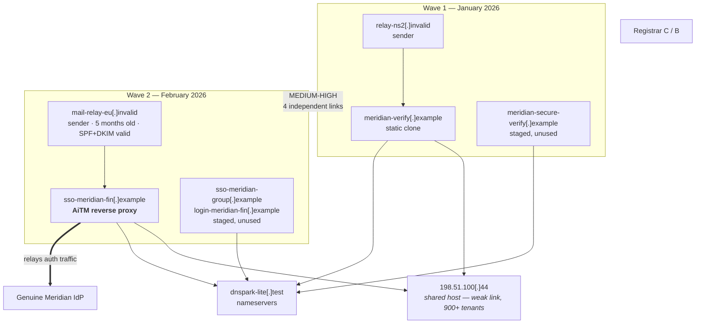

# EU-FIN-001 — Credential Phishing Campaign Investigation

**Flagship case · full investigation record**

| | |
|---|---|
| **Campaign ID** | EU-FIN-001 |
| **Case ID** | CASE-005 |
| **Target** | Meridian Financial Group — fictional EU financial-services firm (~1,800 staff, DE/NL/PL offices) |
| **Opened** | 2026-02-11T08:52Z |
| **Closed** | 2026-02-18T16:00Z |
| **Analyst** | [Author] |
| **Data** | Synthetic — see [DISCLAIMER](../../DISCLAIMER.md) |
| **Classification** | TLP:CLEAR (synthetic) |

> This case builds on CASE-001 to CASE-004, which covered an earlier wave from the same
> campaign designation in January 2026. This record concerns **Wave 2**, which is materially
> more sophisticated, and revisits the Wave 1 conclusions where Wave 2 changes them.

---

## 1. Executive position (analyst's own summary)

A second wave of credential phishing targeted Meridian Financial Group on 2026-02-11,
impersonating the organisation's single sign-on portal. Unlike Wave 1, the landing
infrastructure operated as a **reverse proxy in front of the genuine identity provider**,
which means it was positioned to capture not only passwords but session tokens — defeating
the organisation's push-notification MFA. Eleven users received the message; two
authenticated. Both sessions were invalidated within the response window.

The remainder of this document is the working record: what was observed, what was inferred,
what was rejected, and what remains unknown.

---

## 2. Scope and authorisation

| | |
|---|---|
| Requested by | SOC shift lead, ticket `SOC-2026-0388` |
| Scope | Investigate the reported message, characterise the infrastructure, produce IOCs, TTPs and defensive recommendations |
| Out of scope | Attribution to a named actor; any interaction with adversary infrastructure beyond passive collection and sandboxed retrieval; access to any third-party system |
| Constraints | OSINT and internal telemetry only; no commercial threat-intelligence platform available |

---

## 3. Initial triage (08:52Z – 09:05Z)

| Question | Finding | Source |
|---|---|---|
| Artefact | One reported email, subject `[Action] Re-authenticate your Meridian SSO session` | Abuse mailbox |
| Reporter | Treasury analyst, pseudonymised `user-1182` | — |
| Wave size | 11 recipients, delivered 08:31Z–08:34Z | Gateway search |
| Recipient profile | 9/11 in Treasury or Payments; 2 in Finance leadership | Directory (internal) |
| Interaction | Proxy logs show 4 connections to the linked host; **2 reached a POST endpoint** | Proxy |
| Attachments | None |
| Escalation | **High** — targeting concentration plus confirmed interaction |

The recipient concentration changed the priority immediately. Nine of eleven recipients in
payment-authorising functions is not consistent with an untargeted spray, and it moves the
plausible objective from generic credential resale toward payment fraud.

**Immediate containment requested at 09:05Z, before analysis was complete** — session
revocation and password reset for the two interacting users. Investigation should never block
containment; the two ran in parallel from this point.

---

## 4. Evidence preservation

| File | Description | Acquired (UTC) |
|---|---|---|
| `evidence/eu-fin-001-headers.txt` | Raw header block | 09:07Z |
| `evidence/eu-fin-001-dns.txt` | DNS query record | 09:14Z |
| `evidence/eu-fin-001-redirect-chain.txt` | Sandbox retrieval record | 09:41Z |
| `evidence/eu-fin-001-certificates.txt` | CT log extracts | 10:02Z |
| `evidence/MANIFEST.md` | Hashes and provenance | continuous |

Recipient identities pseudonymised at acquisition. The victim-unique URL token was
substituted with a control value before any sandbox submission and is redacted throughout.

---

## 5. Email header analysis

### 5.1 Identity fields

| Field | Value (defanged) |
|---|---|
| `From` | `Meridian IT Security <no-reply@meridian-fin[.]example>` |
| `Reply-To` | *(absent)* |
| `Return-Path` | `bounce@mx3.mail-relay-eu[.]invalid` |
| `Message-ID` | `<20260211.083104.8812@mx3.mail-relay-eu[.]invalid>` |
| `Date` | `Wed, 11 Feb 2026 08:31:04 +0000` |
| `X-Mailer` | *(absent)* |

**Difference from Wave 1, and why it matters.** Wave 1 carried a `Reply-To` on a lookalike
domain and a `PHPMailer` `X-Mailer` header — both cheap indicators that a gateway rule can
catch. Wave 2 has neither. The operator has removed the easy tells. This is a
**tradecraft observation**, and it has a defensive consequence: detections built on Wave 1's
atomic indicators would not have fired here.

### 5.2 Authentication

```
Authentication-Results: mx.meridian-fin.example;
    spf=pass (sender IP is 203.0.113.140) smtp.mailfrom=mail-relay-eu.invalid;
    dkim=pass header.d=mail-relay-eu.invalid header.s=s1;
    dmarc=fail (p=quarantine sp=quarantine dis=none) header.from=meridian-fin.example
```

This result is the single most instructive item in the case.

> **Observation.** SPF passes. DKIM passes. DMARC fails.
>
> **Evidence.** `Authentication-Results`, `evidence/eu-fin-001-headers.txt` line 14;
> corroborated by independent lookup of `mail-relay-eu.invalid` SPF and the `s1` DKIM
> selector, both of which exist and are valid.
>
> **Interpretation.** The adversary controls `mail-relay-eu[.]invalid` and has configured it
> properly: valid SPF, working DKIM signing. They pass authentication **for their own
> domain**. DMARC fails only because neither authenticated identifier *aligns* with the
> `From:` domain the user sees.
>
> **Alternative explanation.** A legitimate ESP sending on behalf of Meridian would also
> produce SPF and DKIM passes on the ESP's domain. Under relaxed alignment this could even
> pass DMARC if the ESP domain were an organisational-domain match. Tested: Meridian's SPF
> record does not include `mail-relay-eu.invalid`, no contract with this provider exists
> (confirmed internally), and the domain resolves to infrastructure unrelated to any known
> ESP.
>
> **Assessment.** The message was sent from adversary-controlled, correctly-configured
> infrastructure spoofing the display domain. **Confidence: High.**
>
> **Intelligence gap.** Whether `mail-relay-eu[.]invalid` is dedicated to this campaign or a
> general-purpose sending platform the actor rents is unknown; passive-DNS volume would
> indicate but not settle it.

**The teaching point, stated for the report's non-specialist readers:** *"SPF pass" and
"DKIM pass" do not mean "this email is genuine."* They mean the sending domain authorised the
sender. An attacker who owns a domain can always make both pass. Only **DMARC alignment**
connects authentication to the name the user actually sees — and only if the spoofed domain
publishes a policy that the receiver enforces.

Meridian publishes `p=quarantine`. The gateway's disposition was `dis=none` — the policy was
not applied, because the gateway's own allow-listing overrode it. The message reached
eleven inboxes despite a correct DMARC failure. **That control gap, not the phishing
domain, is the most important finding for the defender.**

### 5.3 Received chain

| # | Hop | IP | UTC | Trust |
|---|---|---|---|---|
| 1 | `from [10.0.0.14] by smtp-out-02.mail-relay-eu[.]invalid` | — | 08:31:02 | Untrusted (asserted) |
| 2 | `from smtp-out-02 by mx3.mail-relay-eu[.]invalid` | `203.0.113.140` | 08:31:04 | Untrusted |
| 3 | `from mx3.mail-relay-eu[.]invalid ([203.0.113.140]) by mx.meridian-fin[.]example` | `203.0.113.140` | 08:31:09 | **First trusted hop** |
| 4 | `by mbx-07.meridian-fin[.]example` | internal | 08:31:11 | Internal |

Hop 1 asserts a private RFC 1918 address, indicating submission from behind the sender's own
NAT — consistent with a small sending stack rather than a compromised mail server or a large
ESP. Weak signal, recorded as such.

Injection point: `203.0.113.140`. Everything below hop 3 is the sender's own claim and is not
evidence of anything except what the sender wanted recorded.

### 5.4 Content and pretext

| Element | Observation | Significance |
|---|---|---|
| Salutation | Recipient's real first name and job title | Indicates access to directory-quality data — not present in Wave 1 |
| Pretext | "A new device was registered to your SSO account. If this was not you, re-authenticate to revoke the session." | Inverts urgency: the *security-conscious* response is to click. Effective against trained users |
| Branding | Correct corporate colours, current logo, plausible footer | Suggests reconnaissance of public-facing material |
| Link | Single anchor, `Review sign-in activity` | |
| Href | `hxxps://sso-meridian-fin[.]example/auth/realms/meridian/login?state=[REDACTED]` | Path mirrors the real IdP's URL structure |
| Language | Fluent business English, no grammatical errors | Machine-translated or native; removes a classic user-facing tell |

The `state=` parameter mimicking an OAuth/OIDC flow parameter is a detail worth flagging: the
URL is constructed to survive a user's cursory inspection, including by someone who knows
roughly what a real SSO URL looks like.

**How did the sender obtain names and titles?** Three hypotheses, none resolved:
(i) public professional-network scraping — cheap, sufficient, and consistent with the
seniority skew; (ii) a prior undetected compromise; (iii) a third-party data source or
breach corpus. This is recorded as an intelligence gap, not decided. Hypothesis (i) is
considered most likely on cost grounds alone, at **Low confidence**.

---

## 6. URL and redirect analysis

Sandboxed retrieval with substituted token, 09:41Z, residential egress:

| Hop | URL (defanged) | Status | IP |
|---|---|---|---|
| 1 | `hxxps://sso-meridian-fin[.]example/auth/realms/meridian/login?state=CONTROL` | 200 | `198.51.100.44` |

**No redirect.** Wave 1 used a three-hop chain through an abused shortener; Wave 2 goes
direct. Fewer hops means fewer indicators, fewer third-party logs, and a faster page — again,
reduced signature surface.

### 6.1 The critical observation

The rendered page was **not a static clone**. Sandbox capture recorded:

- The page fetched branding assets from the *genuine* Meridian IdP host.
- Submitted form data produced an outbound request from the phishing host to the genuine IdP.
- The genuine IdP's MFA push challenge was triggered and rendered back through the phishing
  host.
- On successful challenge, the phishing host received a valid session cookie from the IdP.

> **Observation.** The landing host relays authentication traffic bidirectionally between the
> victim and the legitimate identity provider.
>
> **Evidence.** Sandbox network capture, `evidence/eu-fin-001-redirect-chain.txt` §3; the
> response chain shows server-side fetches to the real IdP hostname originating from
> `198.51.100.44`, not from the client.
>
> **Interpretation.** This is an **adversary-in-the-middle (AiTM) reverse-proxy phishing
> kit**, not a credential-harvest clone. The objective is the *session token*, not only the
> password.
>
> **Alternative explanation.** A static clone that merely embeds the real site's images
> would produce client-side asset fetches to the genuine host — superficially similar. This
> was excluded: the asset and authentication requests originate server-side from the phishing
> host's IP, and the MFA challenge completed, which a static clone cannot do.
>
> **Assessment.** The infrastructure is capable of defeating push-notification and OTP MFA by
> capturing the post-authentication session token. **Confidence: High** — the MFA challenge
> completion is directly observed and is not reproducible by any non-proxying design.
>
> **Intelligence gap.** Which specific kit family is in use is unknown. Public reporting
> describes several open-source reverse-proxy phishing frameworks with this behaviour; no
> artefact recovered here distinguishes between them.

This single finding changes the entire incident response. Password reset alone is
**insufficient**; sessions must be revoked, because a stolen token remains valid after a
password change until the session is explicitly invalidated. That recommendation is the most
consequential output of the whole investigation, and it follows from one network-capture
observation.

---

## 7. Domain intelligence

RDAP, 09:58Z:

| Domain | Created | Registrar | NS | Privacy |
|---|---|---|---|---|
| `sso-meridian-fin[.]example` | 2026-02-08T22:14Z | Registrar C | `ns1/ns2.dnspark-lite[.]test` | Redacted |
| `mail-relay-eu[.]invalid` | 2025-09-19T11:02Z | Registrar C | `ns1/ns2.dnspark-lite[.]test` | Redacted |

**Note the asymmetry.** The landing domain is three days old; the sending domain is five
months old with an established sending reputation — which is precisely why its SPF/DKIM pass
and why it was not caught by reputation filtering. The operator treats sending infrastructure
as a long-lived asset and landing infrastructure as disposable. That is an economically
rational division and a durable behavioural observation.

Standing caveats from Case 003 apply in full: age, privacy redaction and registrar identity
are weak indicators individually. What carries weight here is the **structure** — two domains
with different lifecycle roles under one nameserver provider and one registrar, appearing
together in a single observed campaign event (E-04-equivalent: the message from one contained
a link to the other).

---

## 8. DNS analysis

Queries 09:14Z:

| Name | Type | Value | TTL |
|---|---|---|---|
| `sso-meridian-fin[.]example` | A | `198.51.100[.]44` | 120 |
| `sso-meridian-fin[.]example` | MX | *(none)* | — |
| `sso-meridian-fin[.]example` | TXT | *(none)* | — |
| `mail-relay-eu[.]invalid` | A | `203.0.113[.]140` | 3600 |
| `mail-relay-eu[.]invalid` | MX | `10 mx3.mail-relay-eu[.]invalid` | 3600 |
| `mail-relay-eu[.]invalid` | TXT | `v=spf1 ip4:203.0.113.140 -all` | 3600 |
| `s1._domainkey.mail-relay-eu[.]invalid` | TXT | `v=DKIM1; k=rsa; p=…` | 3600 |

Two observations:

1. **No MX on the landing domain.** Unlike Wave 1, exfiltration is not via mail on the
   landing domain — consistent with a reverse-proxy kit, which typically writes captured
   tokens to an operator-side store or messaging channel rather than emailing them.
2. **TTL asymmetry** (120s landing vs. 3600s sending) reinforces §7: the landing host is
   built to move, the sending host is built to persist.

A hardened SPF (`-all`) on the sending domain confirms deliberate deliverability engineering.
The operator wants their mail to be accepted, which tells you they expect to keep using it.

---

## 9. IP and ASN analysis

| | `198.51.100[.]44` (landing) | `203.0.113[.]140` (sending) |
|---|---|---|
| PTR | `srv-shared-118.host-example.test` | `mx3.mail-relay-eu.invalid` |
| ASN | `AS64510` | `AS64502` |
| Holder | Mass shared hosting (RIPE region) | Small VPS provider (RIPE region) |
| Prefix | `198.51.100.0/24` | `203.0.113.128/26` |
| Co-hosted domains | >900 | 3 |
| Exposed services (scan data) | 80, 443 | 25, 80, 443 |
| Abuse contact | Present | Present |

**`198.51.100[.]44` is the same address that hosted Wave 1's landing page.** This is a
significant cross-wave link — but its weight must be assessed honestly. On an address with
900+ tenants, reappearance is **not** strong evidence of the same operator, because the
prior probability of any given campaign landing there is non-trivial. It is corroborating
only in combination with the shared nameserver provider, shared registrar, identical target
and eight-week interval. Taken together: **same operator across both waves, Medium-High
confidence**.

`203.0.113[.]140` with three tenants and a functioning mail stack is a far better blocking
candidate and a far better pivot than the landing IP.

---

## 10. Certificate intelligence

| Cert | SANs | Issuer | Issued (UTC) | Fingerprint |
|---|---|---|---|---|
| C3 | `sso-meridian-fin[.]example` | Free automated CA, DV | 2026-02-09T06:41Z | `SYNTHETIC-CERT-C3` |
| C4 | `sso-meridian-group[.]example`, `login-meridian-fin[.]example` | Same CA | 2026-02-09T06:44Z | `SYNTHETIC-CERT-C4` |

**C4 is a discovery, not a verification.** It was found by a CT string search on the brand
token, covers two domains never seen in any delivered message, and was issued three minutes
after C3 — the same three-minute pattern observed between C1 and C2 in January.

> **Observation.** A recurring ~3-minute issuance gap between a used certificate and an
> unused sibling certificate, across two waves eight weeks apart.
>
> **Evidence.** CT timestamps for C1/C2 (2026-01-11) and C3/C4 (2026-02-09).
>
> **Interpretation.** Consistent with a scripted or batched provisioning routine that
> prepares a primary and a reserve in one run.
>
> **Alternative explanation.** Coincidence. Two independent pairs at similar intervals is a
> thin base for a pattern claim; automated issuance is fast for everyone, so short gaps are
> unremarkable in isolation. What distinguishes this is the *pairing* of one used and one
> unused domain in both instances.
>
> **Assessment.** Batch provisioning of primary-plus-reserve infrastructure is a plausible
> operator practice here. **Confidence: Low-Medium.** Two observations is a hypothesis, not a
> pattern.
>
> **Intelligence gap.** A third wave, or CT data from other targets, would test it. This is
> exactly the kind of hypothesis that should be written down at Low confidence and revisited,
> rather than either asserted or discarded.

**Defensive consequence regardless of confidence:** `sso-meridian-group[.]example` and
`login-meridian-fin[.]example` are staged and unused. Pre-emptive blocking costs nothing and
may pre-empt Wave 3. This is an action that is justified even though the reasoning behind it
is only Low-Medium confidence — because the cost of being wrong is zero.

---

## 11. Infrastructure correlation

Applying the Case 004 edge discipline. Summary of accepted and rejected links:

| Edge | Relationship | Selectivity | Alt. explanation | Confidence |
|---|---|---|---|---|
| Sending domain ↔ landing domain | Message from one linked to the other | Very high — observed causal link | None | **High** |
| C3 ↔ C4 | 3-min CT gap, same CA, same naming scheme | Moderate combined | Coincidental batch timing | **Medium** |
| Wave 1 ↔ Wave 2 | Shared landing IP + shared NS provider + shared registrar + identical target + kit evolution | Individually weak; four **independent** dimensions | Two unrelated actors targeting the same firm using the same budget providers | **Medium-High** |
| Landing IP ↔ 900 co-tenants | Shared IP only | Very low | Mass shared hosting | **REJECTED** |
| Sending IP ↔ 2 co-tenants | Shared IP, low tenancy | Moderate | Small VPS provider co-tenancy | **Low-Medium** — flagged for monitoring, not asserted |
| Either domain ↔ Registrar C portfolio | Shared registrar | Negligible | Millions of domains | **REJECTED** |

The Wave 1 ↔ Wave 2 link deserves comment. Each of its four components is individually weak.
They are accepted in combination because they are **independent choices**: an operator
selects hosting, DNS, registrar and target separately. Had the evidence been "same IP, same
ASN, same /24", that would be one link counted three times, and the conclusion would not
follow.



---

## 12. TTP analysis and MITRE ATT&CK mapping

Mapped **only** where a specific observation supports the technique.

| ID | Technique | Observed behaviour | Evidence | Confidence |
|---|---|---|---|---|
| **T1566.002** | Phishing: Spearphishing Link | Targeted email with a single link to adversary infrastructure, sent to 11 selected recipients | Message artefact; gateway wave data | **High** |
| **T1598.003** | Phishing for Information: Spearphishing Link | Link solicits authentication credentials | Landing-page form structure, sandbox capture | **High** |
| **T1656** | Impersonation | Message and page impersonate Meridian IT Security and the Meridian SSO portal | Body content, page branding, domain naming | **High** |
| **T1583.001** | Acquire Infrastructure: Domains | `sso-meridian-fin[.]example` registered 3 days before use; two further domains staged | RDAP, CT | **High** |
| **T1608.005** | Stage Capabilities: Link Target | Landing infrastructure provisioned (domain, certificate, DNS) prior to delivery | CT issuance 2026-02-09 vs. delivery 2026-02-11 | **High** |
| **T1557** | Adversary-in-the-Middle | Landing host relays authentication traffic between victim and genuine IdP | Sandbox network capture showing server-side requests to the real IdP and completed MFA challenge | **High** |
| **T1539** | Steal Web Session Cookie | Proxy positioned to capture the post-authentication session token | Session cookie observed returned to the proxy host in sandbox | **Medium-High** — capture position directly observed; retention/use by the operator inferred |
| **T1585.002** | Establish Accounts: Email Accounts | Sending domain registered 5 months prior with valid SPF/DKIM, indicating deliberate reputation-building | RDAP creation date; DNS records | **Medium** |

### Techniques deliberately **not** mapped

Listing these is as important as the mappings above.

| Candidate | Why not mapped |
|---|---|
| `T1078` Valid Accounts | No evidence of the adversary *using* captured credentials. Capture position was observed; use was not. Two users authenticated, but no anomalous subsequent sign-in was identified before revocation |
| `T1114` Email Collection | No mailbox access observed |
| `T1586` Compromise Accounts | No evidence the sending domain or any account was compromised rather than registered |
| `T1598.002` Spearphishing Attachment | No attachment present |
| `T1534` Internal Spearphishing | No internal propagation observed |

`T1078` is the one a less disciplined report would include, because it fits the narrative and
would make the incident look more serious. The evidence does not support it, and saying so
protects the credibility of the eight mappings that *are* supported.

---

## 13. Timeline (UTC)

| Timestamp | Event | Source | Reliability |
|---|---|---|---|
| 2025-09-19T11:02Z | `mail-relay-eu[.]invalid` registered | RDAP | A |
| 2026-01-11 → 01-14 | **Wave 1** (CASE-001–004) | Prior cases | A |
| 2026-02-08T22:14Z | `sso-meridian-fin[.]example` registered | RDAP | A |
| 2026-02-09T06:41Z | Certificate C3 issued | CT | A |
| 2026-02-09T06:44Z | Certificate C4 issued (unused domains) | CT | A |
| 2026-02-10 | First passive-DNS resolution of landing domain | pDNS | B — lower bound |
| 2026-02-11T08:31:09Z | First message reaches Meridian gateway | `Received` hop 3 | A |
| 2026-02-11T08:34Z | Last of 11 messages delivered | Gateway | A |
| 2026-02-11T08:39Z | First user connection to landing host | Proxy | A |
| 2026-02-11T08:43Z | First POST to landing host | Proxy | A |
| 2026-02-11T08:47Z | Second POST | Proxy | A |
| 2026-02-11T08:52Z | Message reported by `user-1182` | Abuse mailbox | A |
| 2026-02-11T09:05Z | Sessions revoked, passwords reset for 2 users | IR record | A |
| 2026-02-11T09:41Z | Landing page characterised as AiTM proxy | Sandbox | A |
| 2026-02-13T14:00Z | Landing domain ceases resolving | DNS monitoring | A |

**Preparation-to-delivery interval: ~61 hours** for the landing domain; **~5 months** for the
sending domain. **Delivery-to-first-interaction: 8 minutes.** **Delivery-to-report: 21
minutes.**

The eight-minute figure is the number that should drive defensive investment. No
human-triggered process can be the primary control at that tempo.

---

## 14. Threat assessment

**KJ-1.** Meridian Financial Group was targeted by a credential-phishing campaign
impersonating its SSO portal, delivered from adversary-controlled infrastructure.
**Confidence: High.** Direct artefact evidence; authentication and routing analysis agree;
no alternative explanation survives.

**KJ-2.** The landing infrastructure was an adversary-in-the-middle reverse proxy capable of
capturing session tokens and defeating push/OTP MFA. **Confidence: High.** Directly observed
bidirectional relay with completed MFA challenge — behaviour a static clone cannot produce.

**KJ-3.** Recipient selection was deliberate, concentrated on payment-authorising functions.
**Confidence: Medium-High.** 9 of 11 recipients in Treasury/Payments, with correct names and
titles, is very unlikely under random selection; the alternative (coincidental overlap from a
scraped list) is weakened but not excluded by the directory-quality personalisation.

**KJ-4.** Wave 1 and Wave 2 are probably the same operator. **Confidence: Medium-High.** Four
independent weak links plus coherent capability evolution; the possibility of two unrelated
actors targeting the same firm through the same budget providers is not excluded.

**KJ-5.** Two user sessions were exposed to token capture. **Confidence: High** that exposure
occurred (POST observed); **Low** confidence as to whether tokens were actually used —
no anomalous authentication was identified, but absence of detection over a 26-minute window
is weak evidence.

**KJ-6.** The probable objective is payment fraud or payment-system access rather than generic
credential resale. **Confidence: Medium.** Based on recipient targeting and sector; no direct
evidence of the objective was obtained, and this judgement rests on inference from victimology
alone.

**No attribution to any named threat actor is offered.** The observed tradecraft — reverse-proxy
kit, aged sending domain, brand-lookalike naming — is used by a wide range of financially
motivated actors and is available in commodity and open-source form. Nothing observed is
distinctive enough to narrow it, and claiming otherwise would be unsupported.

---

## 15. Intelligence gaps

| # | Gap | Why it matters | How it could be closed | Feasible? |
|---|---|---|---|---|
| G-1 | Whether captured tokens were used | Determines whether this is an attempted or actual compromise | IdP sign-in log review across all sessions, 72h window | Yes — internal |
| G-2 | Kit family identity | Enables cross-campaign correlation and specific detections | Kit artefact recovery; comparison to public kit reporting | Partially — public reporting only |
| G-3 | How recipient names/titles were obtained | Distinguishes public scraping from prior compromise — very different response | Review public exposure of staff directory; hunt for prior access | Yes — internal |
| G-4 | Whether other EU financial firms were targeted | Sharing value; indicates campaign scale | CSIRT/ISAC enquiry; CT search for sibling brand patterns | Yes — via sharing community |
| G-5 | Operator's exfiltration destination | Would extend the infrastructure picture beyond this campaign | Not obtainable via OSINT | No |
| G-6 | Why the gateway did not apply DMARC quarantine | **Root cause of delivery** | Gateway policy and allow-list review | Yes — internal, high priority |
| G-7 | Whether the 3-minute CT pairing is a real operator pattern | Would enable predictive blocking of Wave 3 | Observe a third wave; broader CT study | Partially |

G-6 is the gap most likely to prevent recurrence, and it is entirely within the
organisation's control. An investigation that produced only external IOCs would have missed
it.

---

## 16. Defensive recommendations

| # | Recommendation | Rationale | Owner | Priority | Durability |
|---|---|---|---|---|---|
| 1 | Revoke all sessions for affected users; enforce re-authentication | Password reset alone does not invalidate a stolen token (KJ-2) | IR | **Immediate** | — |
| 2 | Review IdP sign-in logs for the 2 users, 72h window, focusing on impossible travel and new device registration | Closes G-1 | SOC | **Immediate** | — |
| 3 | Block the 2 campaign domains and the 3 staged domains at DNS and proxy | Zero collateral cost | SOC | High | Days |
| 4 | Block `203.0.113[.]140` at the mail gateway | 3 tenants; dedicated sending host | Mail team | High | Days |
| 5 | Do **not** block `198.51.100[.]44` | 900+ unrelated tenants | — | — | — |
| 6 | Fix the gateway allow-list that overrode DMARC quarantine | Root cause of delivery (G-6) | Mail team | **High** | **Permanent** |
| 7 | Move own DMARC policy to `p=reject` once alignment monitoring is clean | Removes this entire attack class for the spoofed domain | Mail team | High | Permanent |
| 8 | Deploy phishing-resistant MFA (FIDO2/WebAuthn) for payment-authorising roles | **The only control that defeats AiTM proxying** — origin binding means a relayed credential cannot be replayed | IAM | **High** | **Permanent** |
| 9 | Alert on IdP authentications where the client's network path or device fingerprint is inconsistent with the user's baseline | Detects proxy-relayed sessions | SOC | Medium | Long |
| 10 | Continuous CT monitoring for brand-lookalike registrations | Both waves were discoverable in CT 2–3 days before delivery | CTI | Medium | **Permanent** |
| 11 | Retro-hunt both waves' indicators across 90 days of proxy, DNS and mail logs | Establishes whether earlier waves succeeded undetected | SOC | Medium | — |
| 12 | Brief Treasury/Payments on this specific pretext, including that the "security-conscious" response was the trap | Targeted, contextual awareness beats generic training | Security awareness | Medium | Medium |
| 13 | Share defanged IOCs and TTPs with the sector CSIRT/ISAC | Closes G-4; reciprocal value | CTI | Medium | — |

Recommendations 6, 7, 8 and 10 are the durable ones. Items 3 and 4 will be obsolete within a
week; the campaign's own infrastructure had already stopped resolving by 2026-02-13.

The honest framing for leadership: **recommendation 8 is the one that matters.** Everything
else raises cost for the adversary. Only origin-bound authentication removes the technique.

---

## 17. SOC operationalisation

Full queries, Sigma rules and hunt questions:
[`../../soc-integration/`](../../soc-integration/).

Summary of the handoff:

| CTI output | SOC action |
|---|---|
| Domain and IP IOCs | Blocklist entries with expiry dates and `shared_infrastructure` exclusions |
| AiTM behavioural pattern | Detection on IdP authentication from unexpected network paths |
| CT pairing hypothesis | Automated brand-string CT monitoring with analyst triage |
| Sending-domain tradecraft (aged domain, valid SPF/DKIM, DMARC-fail) | Gateway rule: quarantine on DMARC fail for own domain, **regardless of allow-list** |
| Pretext pattern (inverted urgency, SSO re-auth) | Awareness content and mail-body heuristic |

---

## 18. Analyst self-critique

Recorded as part of the case, because it is part of the work.

- **Anchoring risk.** Wave 1 primed the expectation of a static clone. The AiTM behaviour was
  identified only because the sandbox network capture was read in full rather than accepting
  the rendered screenshot. A faster, more confident analyst would have missed it — and would
  have recommended password resets alone, which would have left the compromise live.
- **Over-reading the CT pattern.** The 3-minute pairing is seductive and rests on two
  observations. It is deliberately held at Low-Medium and the recommendation derived from it
  (pre-emptive blocking) is justified by zero cost, not by the strength of the pattern.
- **Victimology inference.** KJ-6 (payment-fraud objective) is the weakest judgement in the
  report and is the one most likely to be repeated in a briefing as though it were
  established. It is labelled Medium for that reason.
- **Unclosed internal gaps.** G-1 and G-6 were answerable with internal data not available at
  the time of writing. A report that stops at external OSINT is incomplete; those gaps are
  assigned owners rather than left as observations.
