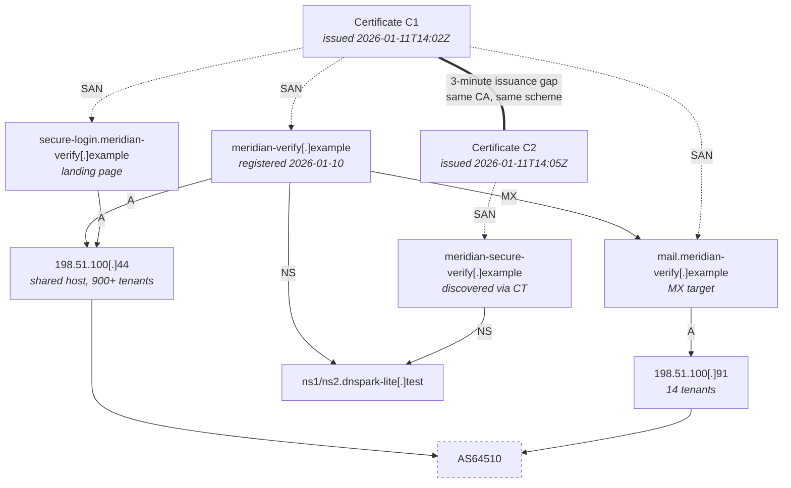

# Case 003 — Phishing Domain Investigation

| | |
|---|---|
| **Case ID** | CASE-003 |
| **Subject** | `meridian-verify[.]example` |
| **Opened** | 2026-01-14T11:20Z |
| **Data** | Synthetic |
| **Classification** | TLP:CLEAR |

---

## 1. Objective

Build a complete public profile of the landing domain and, more importantly, establish
**what each indicator is and is not capable of proving**. This case exists partly to
demonstrate restraint: several of the strongest-looking signals below are shown to carry
little evidential weight.

## 2. Standing caution

> A domain is not malicious because it is new, privacy-protected, cheap, or hosted somewhere
> unfashionable. Each of those describes tens of millions of legitimate domains. They raise
> prior probability marginally; none of them is a finding.

Every subsection below therefore states the indicator's **discriminating power** — how much
the observation distinguishes malicious from benign populations.

## 3. Registration (RDAP)

Query: registry RDAP endpoint, 2026-01-14T11:24Z.

| Field | Value |
|---|---|
| Domain | `meridian-verify[.]example` |
| Created | 2026-01-10T09:31Z |
| Updated | 2026-01-10T09:33Z |
| Expiry | 2027-01-10 |
| Registrar | Registrar B (IANA ID redacted in synthetic data) |
| Status | `clientTransferProhibited` |
| Registrant | Redacted for privacy |
| Nameservers | `ns1.dnspark-lite[.]test`, `ns2.dnspark-lite[.]test` |
| Abuse contact | Registrar abuse address present |

### Discriminating power of each field

| Indicator | Naive reading | Actual weight |
|---|---|---|
| Created 4 days before delivery | "Newly registered = malicious" | **Weak alone.** Several hundred thousand domains are registered daily, overwhelmingly benign. What is informative is not the age but the *sequence*: registration → certificate → DNS → delivery within 96 hours, with no intervening content development. |
| Privacy redaction | "Hiding something" | **Near zero.** Post-GDPR, redaction is the default for EU registrants and is applied by most registrars automatically. Reading intent into it is an error. |
| One-year registration | "Disposable" | **Weak.** One year is also the cheapest default for legitimate registrants. |
| `clientTransferProhibited` | "Locked down deliberately" | **Zero.** This is a registrar default on new registrations. |
| Registrar identity | "Bad registrar" | **Weak.** Correlates with price and signup friction, not with intent. Useful operationally (where to send takedown), not evidentially. |

### What registration *does* establish

A hard lower bound: this domain did not exist before 2026-01-10T09:31Z. Any claim that
infrastructure was prepared earlier must rest on something else. Bounds are the most reliable
thing registration data gives you.

## 4. Nameservers

`ns1/ns2.dnspark-lite[.]test` is a small, low-cost DNS provider. Two implications:

- **Pivot value: moderate.** A niche nameserver is more selective than a hyperscale one. If
  five suspicious domains share a nameserver used by ten thousand domains, that is not
  evidence. If they share one used by a few hundred, it is worth examining. The count matters
  more than the fact.
- **Operational value: high.** It identifies a second abuse contact for takedown.

## 5. DNS records

Queries 2026-01-14T11:31Z (`dig`, authoritative):

| Type | Name | Value | TTL |
|---|---|---|---|
| A | `meridian-verify[.]example` | `198.51.100[.]44` | 300 |
| A | `secure-login.meridian-verify[.]example` | `198.51.100[.]44` | 300 |
| A | `mail.meridian-verify[.]example` | `198.51.100[.]91` | 300 |
| MX | `meridian-verify[.]example` | `10 mail.meridian-verify[.]example` | 300 |
| TXT | `meridian-verify[.]example` | `v=spf1 ip4:198.51.100.91 ~all` | 300 |
| NS | `meridian-verify[.]example` | `ns1/ns2.dnspark-lite[.]test` | 3600 |
| TXT | `_dmarc.meridian-verify[.]example` | *(NXDOMAIN)* | — |

### Analysis

**300-second TTLs.** Low TTLs permit rapid re-pointing. They are also entirely normal for
cloud-hosted and CDN-fronted services. **Weak indicator**, noted for operational reasons: any
A-record-based block will need refreshing frequently.

**The MX record is the significant finding.** The domain is configured to *receive* mail on
a separate IP from the web content. A pure credential-harvest page has no need to receive
mail. Three interpretations, in order of plausibility given the rest of the case:

1. Mail-receiving capability supports **exfiltration of collected credentials to a mailbox on
   the attacker's own domain** — a very common phishing-kit pattern.
2. It enables the operator to receive replies and bounce traffic, consistent with the
   `Reply-To` separation seen in Case 001.
3. It is boilerplate from a hosting template and unused.

**Alternative explanation tested:** hosting providers do frequently provision MX by default.
However, this MX points to a *different IP than the web host*, within the same domain, with a
matching SPF authorisation for exactly that IP. Default templates typically point MX at the
provider's own shared mail host, not at a second dedicated address. That distinction
downgrades interpretation 3 substantially.

**Assessment.** The domain is configured with independent mail-receiving capability, likely
supporting credential exfiltration or reply handling. **Confidence: Medium.** Direct
confirmation would require observing the kit's exfiltration mechanism, which is not available
through OSINT.

**The attacker publishes SPF but not DMARC.** The operator configured SPF for their own
sending, but not DMARC — they are interested in deliverability, not in protecting their own
domain from spoofing. This is a small window into operator priorities. It is an interesting
observation and it is *not* evidence of anything; it is recorded as such.

## 6. Hosting

| Attribute | Web (`198.51.100.44`) | Mail (`198.51.100.91`) |
|---|---|---|
| ASN | `AS64510` | `AS64510` |
| Holder | Mass shared-hosting provider | Same |
| Same /24 | Yes | Yes |
| Co-hosted domains | >900 | 14 |

Both addresses sit in the same provider's `/24`. On a mass-hosting provider this proves
almost nothing — it is the expected outcome of buying two services from one vendor. The
*difference in co-hosting density* between the two addresses is more interesting: `.91` looks
like a lightly-shared or small-plan address, which makes it a marginally better pivot than
`.44`.

## 7. Certificate Transparency

crt.sh identity search for `meridian-verify.example`, and string search for `meridian`:

| Cert | SANs | Issued | Note |
|---|---|---|---|
| C1 | `meridian-verify[.]example`, `secure-login.`, `mail.` | 2026-01-11T14:02Z | Covers the observed infrastructure |
| C2 | `meridian-secure-verify[.]example`, `login.meridian-secure-verify[.]example` | 2026-01-11T14:05Z | **Not previously known** — different registrable domain, issued three minutes later |

C2 is the highest-value discovery in this case. It was found by searching a string, not by
following a link — CT is a **discovery** source, not merely a verification one, and it
routinely exposes infrastructure prepared but not yet used.

**Caution applied:** a string search for `meridian` also returned certificates for unrelated
legitimate organisations using that word. Those were excluded by inspection, not by
assumption. Substring matching is not a relationship.

## 8. Related domains — candidate list

| Domain | Link to subject | Selectivity | Confidence it is related |
|---|---|---|---|
| `meridian-secure-verify[.]example` | Certificate issued 3 min apart, same CA, same naming scheme, same nameservers | Moderate–high in combination | Medium-High |
| Other domains on `198.51.100[.]44` | Shared IP only | **Very low** — >900 tenants | Not assessed as related |
| Other domains on `ns1.dnspark-lite[.]test` | Shared nameserver only | Low | Not assessed as related |

The middle row is the point of this table. The strongest-*looking* signal — nine hundred
domains on the same IP as the phishing site — was discarded entirely, while a three-minute
timing coincidence in CT, corroborated by two other weak links, was retained. Selectivity,
not volume, is what makes a link informative.

Full per-edge treatment: [Case 004](../case-004-infrastructure-correlation/).

## 9. Relationship diagram

Solid edges are directly observed records. Dotted edges are certificate relationships. The
double edge is the temporal correlation — the only inferential link in the diagram, and it is
drawn differently for exactly that reason.

## 10. Key judgements

| ID | Judgement | Confidence | Basis |
|---|---|---|---|
| KJ-1 | `meridian-verify[.]example` was registered and staged specifically for this campaign | High | Registration → certificate → DNS → delivery sequence within 96 hours, with impersonating naming and no other content |
| KJ-2 | The domain has independent mail-receiving capability, likely for exfiltration or reply handling | Medium | Dedicated MX on a separate IP with matching SPF; default-template explanation weakened but not excluded |
| KJ-3 | `meridian-secure-verify[.]example` is probably part of the same operation | Medium-High | Three-minute CT issuance gap, shared nameservers, identical naming convention — three weak-to-moderate links that are mutually independent |
| KJ-4 | Co-hosted domains on `198.51.100[.]44` are **not** assessed as related | High (negative judgement) | Shared-hosting density destroys the inference |

## 11. Intelligence gaps

| Gap | Impact | Closure |
|---|---|---|
| Whether `meridian-secure-verify[.]example` was ever used in delivery | Determines whether to block proactively or monitor | Passive DNS resolution history; mail-gateway retro-hunt |
| Registrant identity behind privacy redaction | Would materially strengthen or break KJ-3 | Registrar disclosure via legal process — not available to OSINT |
| Full subdomain inventory | Unenumerated hosts may serve other stages | CT-derived enumeration only; brute-forcing is active and out of scope |
| Historical resolution before 2026-01-12 | Would confirm staging timeline independently | Commercial passive DNS |
| Whether the kit is a known family | Would enable cross-campaign correlation | Kit artefact recovery — unavailable without unauthorised access |

## 12. Recommendations

| # | Action | Rationale |
|---|---|---|
| 1 | Block `meridian-verify[.]example` and all subdomains | High confidence, no legitimate traffic |
| 2 | Block `meridian-secure-verify[.]example` | Medium-High confidence; collateral cost approximately zero given the domain has no legitimate purpose |
| 3 | Monitor, do **not** block, `198.51.100[.]44` | 900+ unrelated tenants |
| 4 | Register-and-monitor CT alerting for the organisation's brand string | This case was advanced by a CT string search; the same search run continuously is a cheap early-warning control |
| 5 | Retro-hunt both domains across 30 days of proxy and DNS logs | Establishes whether earlier waves landed |

Recommendation 4 is the durable one. Every other item on this list expires with the
infrastructure.
