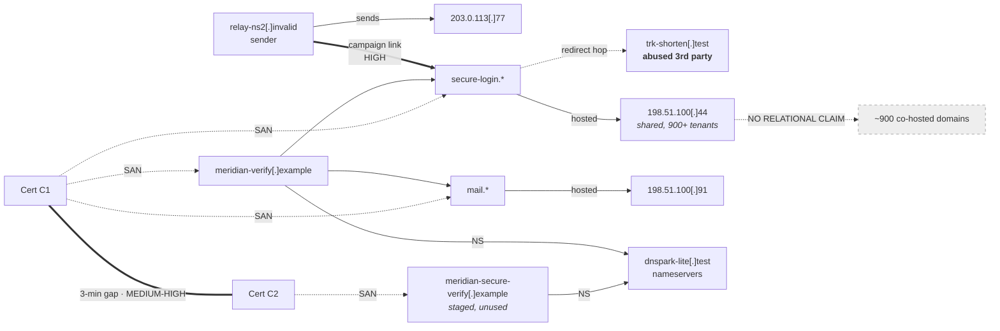

# Case 004 — Infrastructure Correlation

| | |
|---|---|
| **Case ID** | CASE-004 |
| **Starting point** | `meridian-verify[.]example` (CASE-003) |
| **Opened** | 2026-01-15T09:00Z |
| **Data** | Synthetic |
| **Classification** | TLP:CLEAR |

---

## 1. Objective

Determine which of the infrastructure elements discovered so far genuinely belong to one
operation — and, equally importantly, which do not. Every proposed relationship is treated as
a hypothesis to be tested rather than a link to be drawn.

## 2. The core problem

Pivoting is easy and cheap. Each pivot multiplies the candidate set, and the analyst who
follows every edge ends up with a large, impressive graph asserting relationships that do not
exist. Two domains sharing an IP is the canonical example: on shared hosting it is the
expected observation for hundreds of unrelated parties.

The discriminating property is **selectivity**: how many unrelated entities could produce the
same observation by coincidence?

| Link type | Population sharing it | Selectivity | Weight alone |
|---|---|---|---|
| Same certificate (identical fingerprint / SAN bundle) | Only entities that proved control of all names at issuance | Very high | Strong |
| Same unique registrant email (disclosed) | One registrant | Very high | Strong |
| Same phishing-kit file hash | Users of that kit build | High | Strong |
| Same dedicated IP, low tenancy | Few | Moderate-high | Moderate |
| Same niche nameserver (hundreds of domains) | Hundreds | Moderate | Weak |
| Same favicon / HTML structure hash | Users of that template | Moderate | Weak-moderate |
| Same JARM / TLS fingerprint | Everyone running that stack | Low | Very weak |
| Same shared IP, high tenancy | Hundreds to thousands | Very low | None |
| Same registrar | Millions | Negligible | None |
| Same large ASN / cloud provider | Millions | Negligible | None |
| Same TLD | Millions | Negligible | None |

**Rule applied throughout this casebook:** no common-operation claim rests on a single
non-selective link. Two or more *independent* links, or one highly selective link, are
required.

Independence matters as much as selectivity. Shared IP and shared ASN are not two links —
the second is implied by the first.

## 3. Candidate inventory

| ID | Element |
|---|---|
| A | `meridian-verify[.]example` |
| B | `secure-login.meridian-verify[.]example` |
| C | `mail.meridian-verify[.]example` |
| D | `meridian-secure-verify[.]example` |
| E | `relay-ns2[.]invalid` (mail sender, CASE-001) |
| F | `198.51.100[.]44` (web host) |
| G | `198.51.100[.]91` (mail host) |
| H | `203.0.113[.]77` (sending host) |
| I | `AS64510` (hosting) |
| J | `AS64501` (sending) |
| K | Certificate C1 |
| L | Certificate C2 |
| M | `ns1/ns2.dnspark-lite[.]test` |
| N | `trk-shorten[.]test` (redirector, CASE-002) |

## 4. Edge register

Every candidate relationship, accepted or rejected.

---

### E-01 — A ↔ B, C (accepted)

| | |
|---|---|
| **Relationship** | Subdomains of the same registrable domain |
| **Evidence** | DNS A and MX records, `evidence/dns-004.txt` |
| **Source** | Authoritative DNS (A) |
| **Selectivity** | Definitional — control of the zone is required |
| **Alternative explanation** | None credible. A compromised zone could host a third party's subdomain, but nothing here suggests compromise |
| **Confidence** | **High** |

---

### E-02 — A ↔ K (accepted)

| | |
|---|---|
| **Relationship** | Certificate C1 lists A, B and C as SANs |
| **Evidence** | CT log entry, issued 2026-01-11T14:02Z |
| **Source** | crt.sh (A) |
| **Selectivity** | High — issuance required demonstrated control of all three names |
| **Alternative explanation** | A hosting platform bundling unrelated customers into one SAN list. Checked: the SANs are all within one registrable domain, so bundling is not applicable here |
| **Confidence** | **High** |

---

### E-03 — A ↔ D (accepted, Medium-High)

| | |
|---|---|
| **Relationship** | Assessed common operation |
| **Evidence** | (i) Certificates C1 and C2 issued 3 minutes apart by the same CA; (ii) identical nameserver pair; (iii) identical naming convention (`meridian-` + verification verb); (iv) registered within the same 24-hour window |
| **Source** | crt.sh (A), RDAP (A), DNS (A) |
| **Selectivity** | Each link individually weak-to-moderate; **combined and mutually independent** |
| **Alternative explanation** | Two unrelated actors independently targeting the same brand in the same week using the same budget registrar and the same free CA. Not impossible — brand-targeting clusters do occur, and lookalike domains for a given brand are often registered by multiple unrelated parties. This is why the confidence is not High |
| **Confidence** | **Medium-High** |
| **What would raise it** | A shared kit hash, shared exfiltration address, or a single certificate covering both registrable domains |
| **What would break it** | Evidence that `dnspark-lite[.]test` is a default nameserver for Registrar B, which would collapse link (ii) from moderate to negligible. *This was checked: it is not the registrar default.* |

The explicit falsification check in the last row is the part that matters. An analyst who
does not know what would break their own hypothesis has not tested it.

---

### E-04 — A ↔ E (accepted, High)

| | |
|---|---|
| **Relationship** | Delivery infrastructure and landing infrastructure in one campaign |
| **Evidence** | The message sent from E contained a URL whose redirect chain terminated on B; personalisation token consistent end-to-end |
| **Source** | Primary artefact (A) |
| **Selectivity** | Very high — this is a direct causal link observed in the artefact, not an inferred correlation |
| **Alternative explanation** | None credible |
| **Confidence** | **High** |

Note that this — the strongest edge in the graph — comes from the original email, not from
any OSINT pivot. Campaign-level linkage is usually established by the artefact; OSINT extends
it.

---

### E-05 — A ↔ F, and F ↔ other tenants (REJECTED)

| | |
|---|---|
| **Proposed relationship** | Domains co-resolving to `198.51.100[.]44` belong to the same operator |
| **Evidence** | Reverse-IP lookup returns >900 domains |
| **Source** | Reverse-IP service (C) |
| **Selectivity** | **Very low** |
| **Alternative explanation** | `198.51.100[.]44` is a mass shared-hosting address. PTR (`srv-shared-118`) and tenancy density both indicate virtual hosting. Hundreds of unrelated customers share it by design |
| **Confidence in common operation** | **Rejected** — the observation is fully explained by shared hosting |

A ↔ F is retained only as a *hosting fact* ("A is hosted on F"), not as a relational edge
between A and anything else on F. The distinction is easy to lose in a graph view, and losing
it is how analysts publish clusters of innocent websites.

---

### E-06 — A ↔ I / E ↔ J (REJECTED as relational)

| | |
|---|---|
| **Proposed relationship** | Common ASN indicates common operator |
| **Selectivity** | Negligible — the two elements are on *different* ASNs in any case |
| **Assessment** | ASN is recorded as context (who to send abuse reports to, what class of hosting) and carries no relational weight |

---

### E-07 — A, D ↔ M (accepted as weak corroboration only)

| | |
|---|---|
| **Relationship** | Shared nameserver pair |
| **Evidence** | NS records for both domains |
| **Source** | Authoritative DNS (A) |
| **Selectivity** | Low-moderate. `dnspark-lite[.]test` serves an estimated several hundred domains (synthetic figure). Not a hyperscale provider, not exclusive |
| **Alternative explanation** | Two unrelated registrants choosing the same budget DNS provider — entirely ordinary |
| **Confidence as a standalone link** | **Low** |
| **Role** | Contributes to E-03 as one of several independent weak links; asserts nothing by itself |

---

### E-08 — chain ↔ N (accepted, but classified differently)

| | |
|---|---|
| **Relationship** | The redirect chain traverses `trk-shorten[.]test` |
| **Evidence** | HTTP 302 observed in sandbox retrieval |
| **Source** | Sandbox (A) |
| **Selectivity** | High for the *event*, zero for *ownership* |
| **Alternative explanation** | N is a general-purpose link-shortening service being abused, as such services routinely are |
| **Assessment** | N is **abused third-party infrastructure**, not adversary infrastructure |
| **Confidence** | **Medium-High** |
| **Consequence** | N is an abuse-report target. It must **not** enter a blocklist — doing so would break legitimate use of a shared service |

Correctly classifying abused-legitimate versus adversary-owned infrastructure is one of the
highest-value judgements in a phishing investigation, and one of the most commonly botched.

---

## 5. Resulting graph

The rejected cluster is drawn deliberately. A correlation graph that shows only accepted edges
hides the analyst's judgement; showing what was excluded, and why, is what makes the graph
reviewable.

## 6. Cluster assessment

| Cluster | Members | Assessment | Confidence |
|---|---|---|---|
| **Core campaign** | E, H, A, B, C, G, K | Single operation | High |
| **Extended (staged)** | D, L | Probably the same operation; no evidence of use in delivery | Medium-High |
| **Abused third party** | N | Not adversary-controlled | Medium-High |
| **Non-related** | ~900 co-tenants of F, all of `AS64510`, all of Registrar B's portfolio | Explicitly excluded | High (negative) |

## 7. Why contextual evidence is required

Three observations from this case, stated generally:

1. **The same observation means different things in different contexts.** Two domains on one
   IP is strong evidence on a dedicated server and no evidence on shared hosting. The
   observation alone is uninterpretable; the hosting context determines its weight.
2. **Independent weak links can combine; dependent ones cannot.** E-03 is supported by
   certificate timing, nameserver choice, naming convention and registration window — four
   things an actor chooses separately. Shared IP and shared ASN would have been one link
   counted twice.
3. **Falsifiability is the test of an analytic claim.** Each accepted edge above records what
   would break it. E-03 survived its check; E-05 failed its own.

## 8. Intelligence gaps

| Gap | Impact | Closure |
|---|---|---|
| Kit identification | A shared kit hash would move E-03 to High and enable cross-campaign correlation | Kit artefact recovery — not available via OSINT |
| Registrant identity | Would resolve E-03 definitively | Legal process |
| Exfiltration destination | Would link the cluster to actor-controlled infrastructure beyond this campaign | Not available |
| Tenancy figures for M | E-07's weight depends on the real domain count | Passive DNS reverse-NS query (commercial tier) |
| Whether D was ever delivered | Determines proactive block vs. monitor | Cross-organisational enquiry via CSIRT/ISAC |

## 9. Output

- Cluster definition for IOC tagging (`iocs/iocs.json`, `cluster: EU-FIN-001`)
- Explicit exclusion list, so the rejected edges are not re-proposed in a later case
- Hunt questions derived from cluster behaviour: [`../../soc-integration/`](../../soc-integration/)
