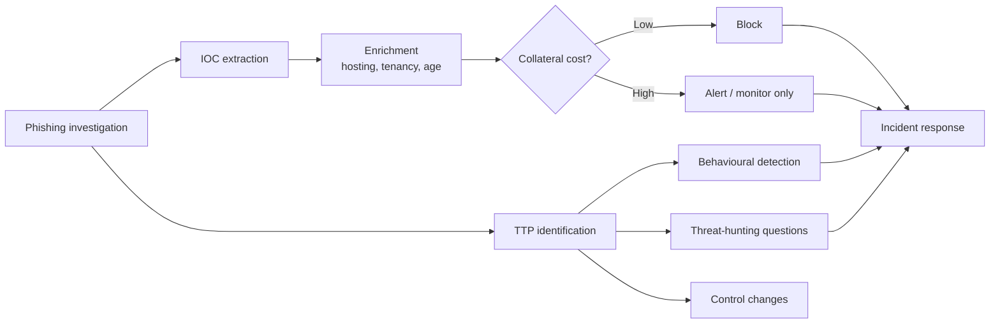

# SOC Integration

Intelligence that does not change what the SOC sees is a document, not a capability. This
section maps the casebook's findings onto detection, hunting and control changes.

> **All queries, field names and log excerpts below are synthetic.** They illustrate logic,
> not any real production environment. Field names differ between deployments and must be
> adapted before use.

---

## The pipeline



The `collateral cost` decision point is the part most often missing. It is the reason
`198.51.100[.]44` never reaches the blocklist despite being high-confidence campaign
infrastructure.

---

## 1. Indicator operationalisation

| IOC class | Destination | Notes |
|---|---|---|
| Sending domains | Mail gateway block, DNS sinkhole | Highest value — Wave 2's sending domain was five months old and reputationally clean |
| Landing domains | Proxy/DNS block | Expires fast; Wave 2's stopped resolving in 48 hours |
| Staged domains (CT-discovered, never delivered) | Proactive block | Zero collateral cost, may pre-empt the next wave |
| Dedicated sending IPs | Mail gateway block | Verify tenancy first |
| Shared-hosting IPs | **Alert only** | Never block |
| Spoofed victim-owned addresses | Enrichment context | Never block |
| Certificate fingerprints | CT monitoring, pivoting | Poor blocking primitive, excellent pivot |

---

## 2. Detection logic

### 2.1 DMARC failure on own domain, delivered anyway

This would have caught both waves, and directly addresses the root cause in EU-FIN-001: a
gateway allow-list overrode the quarantine policy.

**Splunk SPL (synthetic fields):**

```spl
index=email sourcetype=mail:gateway
| where header_from_domain="meridian-fin.example"
| where dmarc_result="fail"
| where disposition!="quarantine" AND disposition!="reject"
| stats count, values(sender_ip) as sender_ips, values(envelope_from) as env_from,
        dc(recipient) as recipients by header_from_domain, disposition
| where count > 0
```

The `disposition!=quarantine` clause is the point. Alerting on DMARC failure alone produces
noise; alerting on **DMARC failure that was not enforced** produces a short, actionable list
and surfaces allow-list misconfiguration.

**Sigma:**

```yaml
title: DMARC Failure For Internal Domain Delivered To Inbox
id: 8f2c1a40-0000-4000-a000-eufin001aaaa
status: experimental
description: >
  Detects messages spoofing an internal sender domain that failed DMARC but were
  delivered rather than quarantined, typically due to gateway allow-listing.
logsource:
  product: email
  service: gateway
detection:
  selection:
    header_from_domain: 'meridian-fin.example'
    dmarc_result: 'fail'
  filter_enforced:
    disposition:
      - 'quarantine'
      - 'reject'
  condition: selection and not filter_enforced
falsepositives:
  - Legitimate third-party senders not yet added to SPF/DKIM (onboarding gaps)
  - Mailing-list expanders that break DKIM signatures
level: high
```

### 2.2 Authentication passes for a non-aligned domain

Wave 2's defining characteristic: `spf=pass`, `dkim=pass`, `dmarc=fail`. A rule that requires
SPF *failure* would have missed it entirely.

```spl
index=email sourcetype=mail:gateway
| where spf_result="pass" AND dkim_result="pass" AND dmarc_result="fail"
| eval auth_domain=coalesce(dkim_d, envelope_from_domain)
| where header_from_domain!=auth_domain
| stats count, dc(recipient) as recipients, values(sender_ip) as ips
        by header_from_domain, auth_domain
| sort - recipients
```

### 2.3 Newly observed domain contacted shortly after email delivery

Correlates mail and proxy telemetry — the pattern behind the eight-minute
delivery-to-first-click interval.

```spl
index=proxy earliest=-24h
| lookup domain_first_seen domain OUTPUT first_seen
| eval age_hours=round((now()-strptime(first_seen,"%Y-%m-%dT%H:%M:%SZ"))/3600,1)
| where age_hours < 168
| join type=inner user
    [ search index=email sourcetype=mail:gateway earliest=-24h dmarc_result="fail"
      | rename recipient as user | fields user, _time, url_domain ]
| where url_domain=domain
| table _time, user, domain, age_hours, dest_ip, http_method
```

### 2.4 Adversary-in-the-middle session indicators

The behavioural detection that survives all infrastructure rotation.

**Microsoft Sentinel / KQL (synthetic):**

```kql
SigninLogs
| where TimeGenerated > ago(7d)
| where ResultType == 0
| extend ASN = tostring(parse_json(tostring(DeviceDetail)).asn)
| join kind=leftouter (
    UserBaseline
    | project UserPrincipalName, BaselineASNs, BaselineCountries
  ) on UserPrincipalName
| where ASN !in (BaselineASNs) and Location !in (BaselineCountries)
| where AuthenticationRequirement == "multiFactorAuthentication"
| project TimeGenerated, UserPrincipalName, IPAddress, ASN, Location,
          AppDisplayName, DeviceDetail
```

Rationale: in an AiTM relay the authentication reaches the IdP **from the proxy host**, not
from the user's device. The sign-in therefore originates from hosting-provider address space
that is inconsistent with the user's baseline — while still showing a *successful* MFA
result. Successful MFA from a datacentre ASN is the signature.

**Supporting signals worth correlating:** new device or token registration immediately after
sign-in; sign-in from a hosting ASN followed within minutes by mailbox rule creation; two
successful sign-ins from geographically inconsistent locations within a short window.

### 2.5 Certificate Transparency monitoring for brand lookalikes

Both waves were visible in CT two to three days before delivery. This is the earliest
available warning and it costs nothing.

```
Monitor CT log stream for newly issued certificates where any SAN matches:
  *meridian*        (brand token)
  *meridian-fin*
  *sso*meridian*
  *login*meridian*
Exclude: SANs under the organisation's own registered domains.
Triage: analyst review of each match; most will be unrelated legitimate organisations
        using the same word. Substring match is not a relationship.
```

Expect false positives. The triage cost is a few matches per week against two to three days
of advance warning on a targeted campaign.

---

## 3. Threat-hunting questions

Questions, not queries — each should be answerable from existing telemetry and each survives
the death of every indicator in this casebook.

**Delivery**

1. Which messages in the last 90 days spoofed an internal sender domain, failed DMARC, and
   were nonetheless delivered to an inbox? *(Directly surfaces the EU-FIN-001 root cause.)*
2. Which external sending domains that pass SPF and DKIM for themselves have sent mail
   claiming an internal `From:` domain?
3. Are there mail-gateway allow-list entries with no documented owner or business
   justification?

**Interaction**

4. Which users connected to a domain less than seven days old within thirty minutes of
   receiving an email containing that domain?
5. Which POST requests went to domains registered in the previous fortnight?
6. For any domain in the campaign clusters, is there *any* connection in the preceding 90
   days — which would indicate an earlier wave that went undetected?

**Post-authentication (AiTM-specific)**

7. Which successful MFA sign-ins in the last 30 days originated from hosting-provider ASNs
   rather than residential or corporate networks?
8. Were any new authentication methods, device registrations, or mailbox forwarding rules
   created within one hour of a sign-in from an unusual network path?
9. Are there active sessions whose originating IP differs from the network path of all other
   recent activity for that user?

**Targeting**

10. Do the recipients of any phishing wave share a role attribute — and is that attribute
    inferable from public sources? *(Answers intelligence gap G-3.)*
11. Which staff with payment-authorisation rights are currently protected only by
    push-notification MFA?

---

## 4. Enrichment pipeline

Before an indicator reaches enforcement, it should carry:

| Enrichment | Source | Decision it informs |
|---|---|---|
| Domain age | RDAP | Risk weighting (weak on its own) |
| Hosting tenancy count | Reverse-IP | **Block vs. alert** — the critical one |
| ASN and holder type | RIR RDAP / routing data | Abuse contact, hosting class |
| CT issuance history | crt.sh | Staging timeline, sibling discovery |
| Ownership by the organisation | Internal asset inventory | Prevents self-blocking |
| Prior sightings | Internal IOC store | Cross-wave correlation |

The tenancy check is the one that prevents outages. It should be automated and it should be
blocking-by-default: no IP reaches an enforcement list without a tenancy figure attached.

---

## 5. Email-security controls

| Control | Addresses | Priority |
|---|---|---|
| Enforce DMARC disposition without allow-list override | EU-FIN-001 root cause | **Highest** |
| Own domain to `p=reject` after clean alignment monitoring | Entire spoofing class | High |
| External-sender banner, applied to *all* external mail | Display-name impersonation | Medium |
| Warn on internal-lookalike display names from external senders | Both waves' pretext | Medium |
| URL rewriting with click-time re-analysis | Cloaking and delayed weaponisation | Medium |
| Attachment and link detonation from residential egress | Cloaking against datacentre scanners | Medium |
| FIDO2/WebAuthn for payment-authorising roles | **AiTM — the only control that removes it** | High |

The last row is the one that matters. Every other control raises the adversary's cost;
origin-bound authentication removes the technique, because a credential relayed through a
proxy cannot be replayed against a different origin.

---

## 6. Handoff to incident response

| CTI finding | IR action |
|---|---|
| AiTM proxy confirmed | **Revoke sessions**, not just reset passwords — a stolen token survives a password change |
| Two users POSTed credentials | Immediate revocation; 72h sign-in review; check for new device/method registration |
| Sending domain still active | Abuse report to hosting provider and registrar |
| Staged domains identified | Pre-emptive block; monitor for resolution as a Wave 3 early warning |
| Recipient targeting identified | Role-based control review for the targeted function |
| Gateway override identified | Configuration change with owner and deadline |
